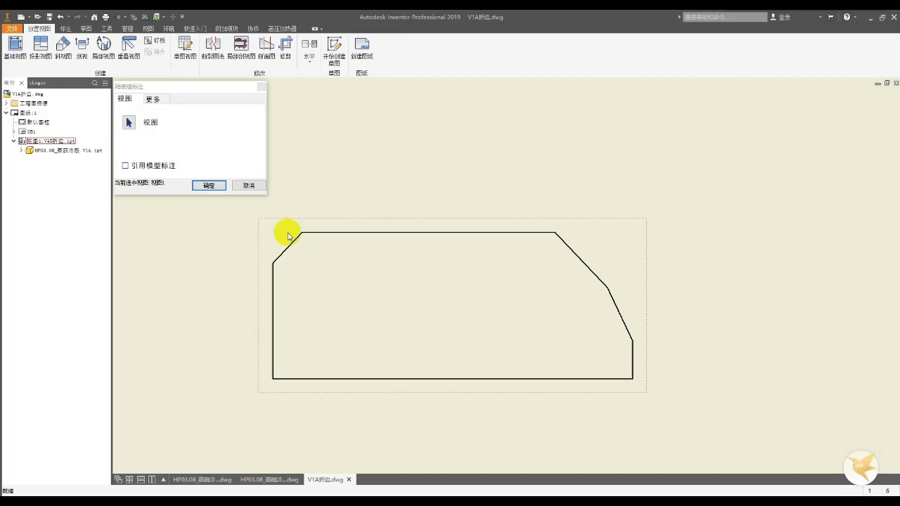
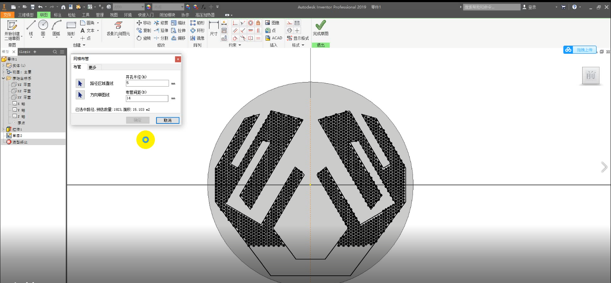

# DuInventorExension
Some Extension methods for AutoDesk Inventor

## Usage

* Clone this repos

* Import Namespace to you *.vb

```vb
Imports Du.InventorExtension
Imports Inventor
```

* Use Extension Methods for Inventor api
 
```vb
' 判断点在视图左边还是右边,返回左中心点或者右中心点
Dim basePoint As Point2d = Nothing
basePoint = View.GetLeftOrRightPoint(centerPoint, direc)
```

## Examples of using it

<div align="center">
    
    
</dic>


